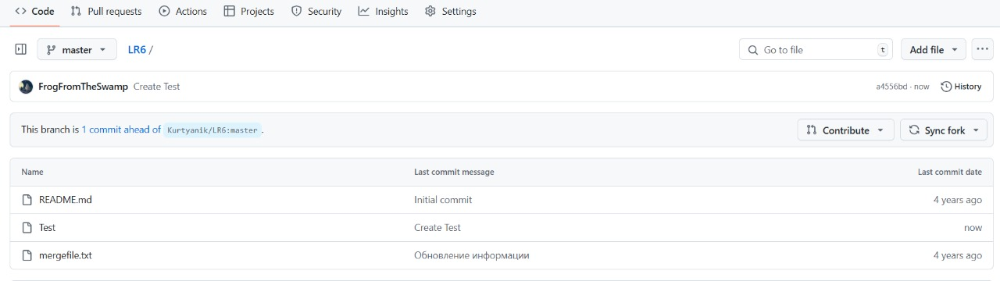
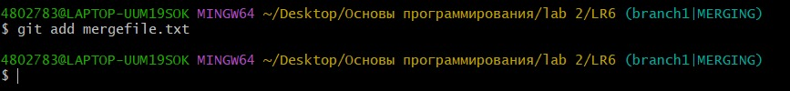

# LR6
Лабораторная работа №6
1. Создём форк репозитория
 
2. Заполняем имя пользователя и адрес электронной почты  
 
3. Делаем клонирование удаленного репозитория 
 
4. Добавляем файл на странице репозитория на GitHub 
 
5. Переходим в папку LR6 и добавляем изменения в локальный репозиторий

6. Получаем историю для каждой ветки и смотрим последние три изменения ветки 

7. Выполняем слияние и разрешаем конфликт  
7.1. Переходим в ветку brunch1  
 
7.2. Выполняем слияние и получаем сообщение о конфликте 
 
7.3. Выясняем причину конфликта  
 
7.4. Меняем файл и решаем причину конфликта  
 
7.5. Добавляем содержимое рабочего каталога в индекс, чтобы совершить коммит  
  
7.6. Проверяем статус  

8. Удаляем побочную ветку master  
 
9. Добавляем в индекс новый текстовый файл, проверяем статус, добавляем в индекс, делаем коммит 
 
10. Делаем изменения в file1.txt, добавляем их в индекс, делаем коммит  

11. Проверяем статус, добавляем в индекс новый текстовый файл, делаем коммит  

12. Делаем хард откат коммита  
 
12. Создаем ветку для отчета  
 
13. Отправляем все данные на удаленный репозиторий  
 
# Лог команд
git config global user.name/email  
git clone https://github.com/FrogFromTheSwamp/LR6.git  
cd LR6  
git pull  
git reflog --all  
git log -p -3 
git checkout branch1  
git merge master  
git diff  
git add mergefile.txt  
git status  
git commit -m "Branches merge" 
git status 
git commit -m "Delete branch master" 
git add file1. 
git commit -m "New change in the file1.txt" 
git status 
git add file2.txt 
git commit -m "New file2.txt" 
git reset --hard HEAD  
git checkout -b report  
git branch  
git push --set-upstream origin report  
 # История операций
a9eb337 2024-11-13 | New file2.txt (HEAD -> report, origin/report, branch1) [Группа 4316 Жукова А. А.] 
0bf799d 2024-11-13 | New change in the file1.txt [Группа 4316 Жукова А. А.] 
db4de96 2024-11-13 | New file [Группа 4316 Жукова А. А.] 
d20ca1a 2024-11-13 | Branches merge [Группа 4316 Жукова А. А.] 
a4556bd 2024-11-13 | Create Test (origin/master, origin/HEAD, master) [Арина Жукова] 
921f53b 2020-11-21 | Обновление информации [Kurtyanik] 
0f9f50d 2020-11-21 | Заполнил файл (origin/branch1) [Kurtyanik] 
c08a654 2020-11-21 | Файл создан пустым [Kurtyanik] 
3c6e913 2020-11-21 | Initial commit [Kurtyanik] 
